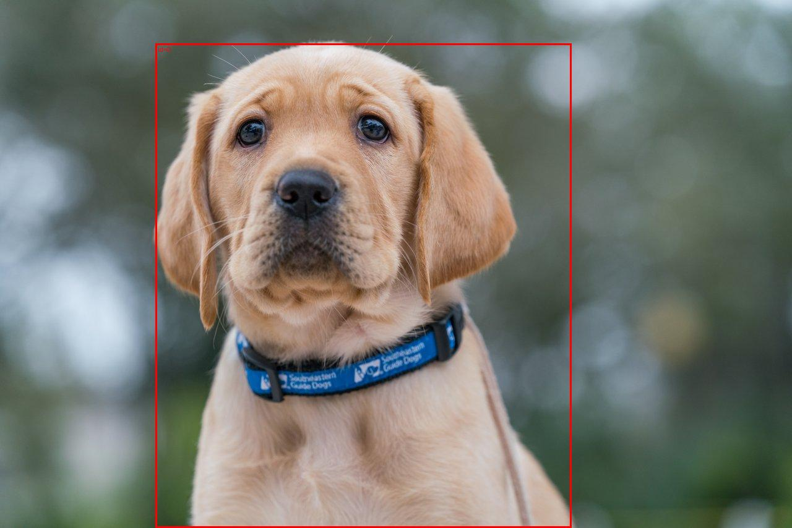
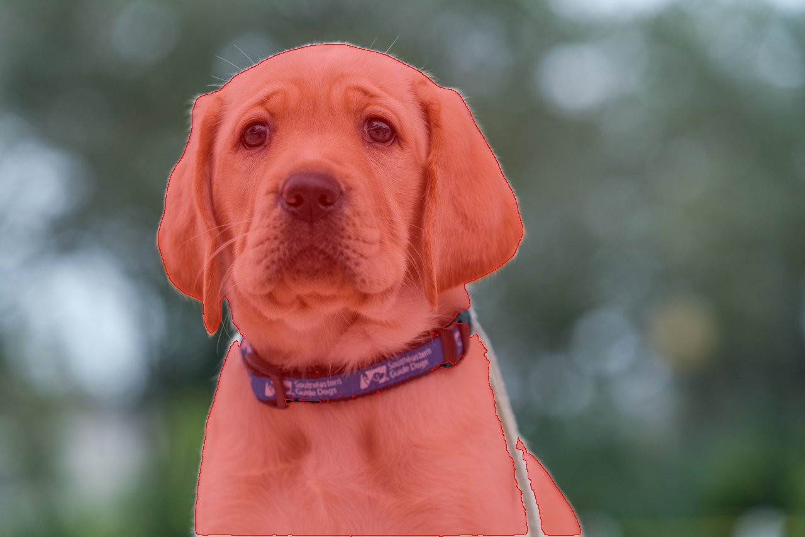

# sam3 — SAM 3.1 image segmentation demo (Meta Model API)

Sample command line app that sends a text prompt plus an image file to the
[`sam-3.1`](https://dev.meta.ai/docs/media-segmentation) endpoint and shows
what comes back: a bounding **box** per match plus a pixel-accurate **mask**
(the non-rectangular outline).

## Setup

Create a `.env` file in this folder with your key (see `.env.example`):

```text
MODEL_API_KEY=your-key-here
```

Then install dependencies:

```bash
uv sync
```

## Usage

```bash
uv run sam3 "dog" ./dog.jpg
```

With all options:

```bash
uv run sam3 --prompt "dog" --image ./dog.jpg \
  --svg-dir ./outlines \
  --overlay ./dog_segmented.jpg \
  --raw-output ./dog_raw.txt \
  --mask-encoding lossless
```

| Option | What it does |
|---|---|
| `prompt`, `image` (positional) | Concept noun phrase (e.g. `"glasses"`) and a local image file or `http(s)` URL |
| `--mask-encoding lossless\|one_bit` | Mask payload encoding (`one_bit` is smaller, good for video) |
| `--stream` | Stream response deltas instead of a single request |
| `--overlay PATH` | Box-overlay PNG (default `<image-stem>_segmented.png`; `--no-overlay` skips it) |
| `--svg-dir DIR` | Per-object SVG outline files (`mask_<id>.svg`, pure Python via `meta-sam-parser`) |
| `--raw-output FILE` | Save the raw special-token `output_text` lane |

Prompt tips (from the [docs](https://dev.meta.ai/docs/sam/segmenting)): name one
concrete object per request (`"yellow school bus"`, not `"segment the bus"`).
No match is a normal empty result, not an error.

## Example

Input (`dog.jpg`, 1280x854):


Box output (`dog_segmented.jpg`) — the rectangle locator:



Mask output (`dog_masked.jpg`, composited from `outlines/mask_0.svg`) — the
non-rectangular pixel outline:



Actual CLI output for this run:

```text
model: sam-3.1
prompt: "dog"
image: ./dog.jpg

--- 1 match(es) ---
id=0 box=(251,70)-(923,853) on 1280x854 mask=784x673 encoding=lossless
id=0 outline -> outlines/mask_0.svg (mask 784x673)
overlay saved to dog_segmented.jpg
```

Each SVG (`outlines/mask_<id>.svg`) holds the decoded polygon path scaled into
source pixels, plus the box as a `<rect>` — open it in a browser over the
source image and the outline lines up 1:1.

## How it works

`src/sam3/__init__.py` (entry point `sam3`):

1. Loads `MODEL_API_KEY` from `.env`, encodes local images as `data:` URLs.
2. Calls `POST https://api.meta.ai/v1/responses` with `model="sam-3.1"` via the
   OpenAI SDK (Responses API, same shape as the
   [media-segmentation](https://dev.meta.ai/docs/media-segmentation) examples).
3. Prints the raw special-token lane, parses boxes/masks per the
   [wire grammar](https://dev.meta.ai/docs/sam/reading-segmentation).
4. Draws the box overlay with Pillow; decodes masks to SVG with the native
   [`meta-sam-parser`](https://dev.meta.ai/docs/sam/client-libraries) package.
